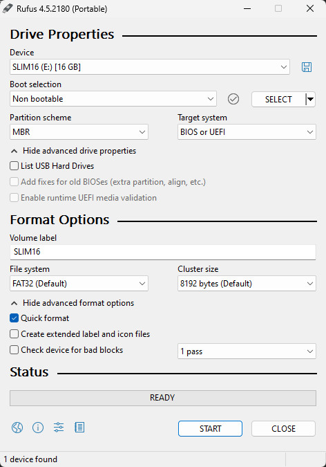
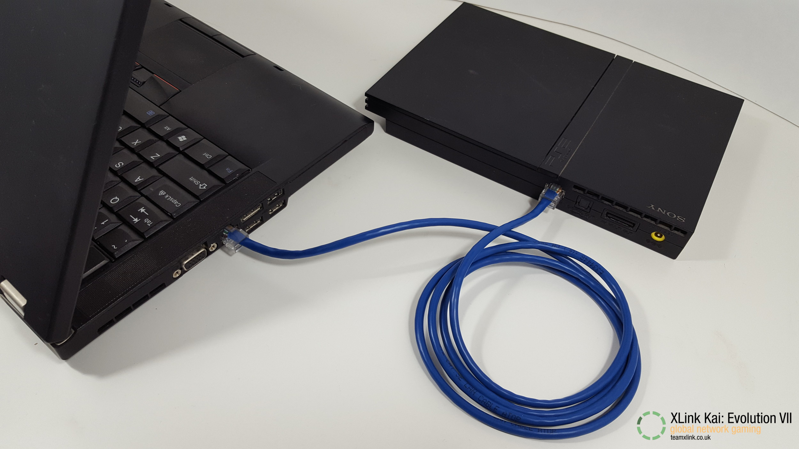
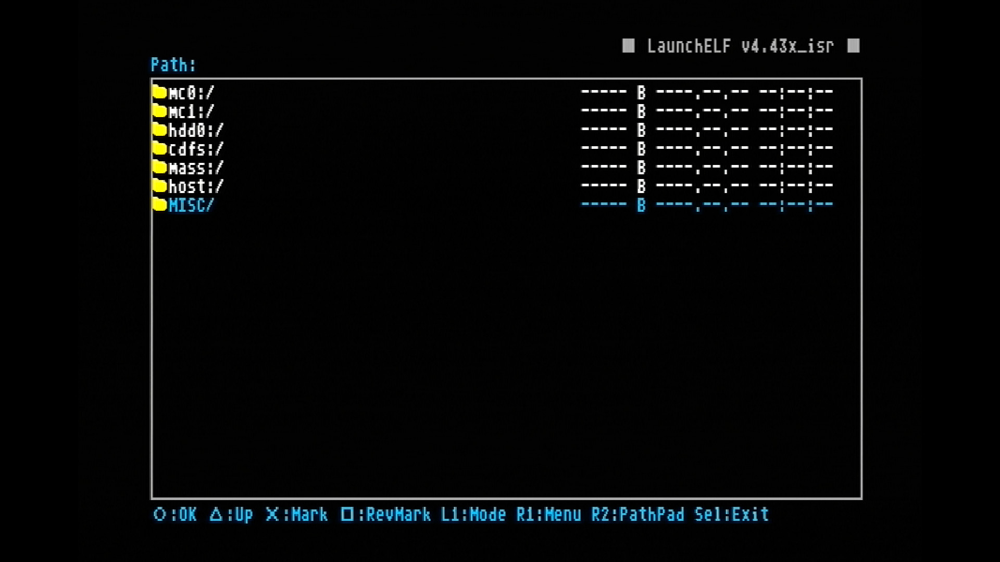
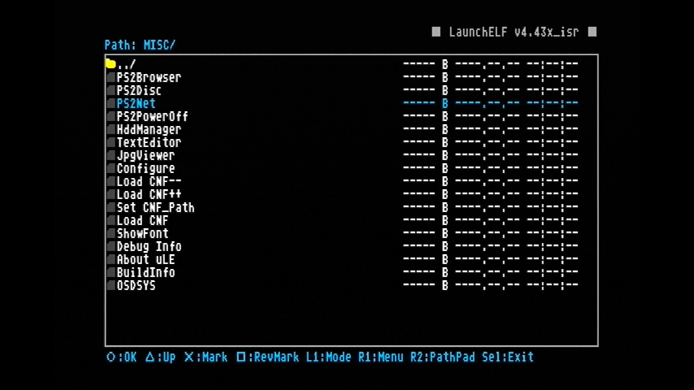
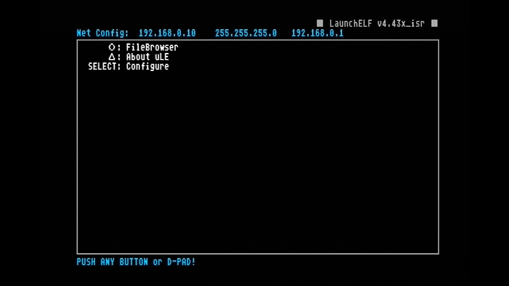
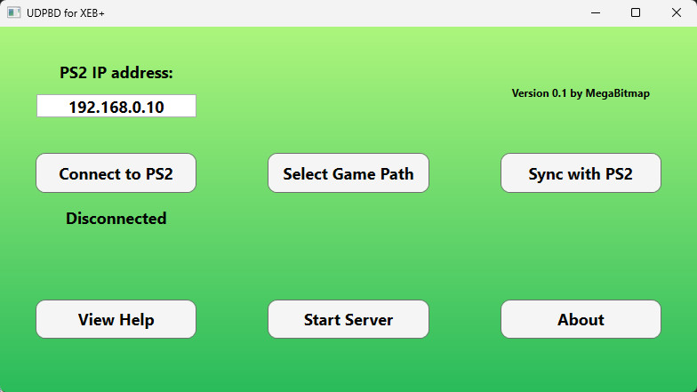
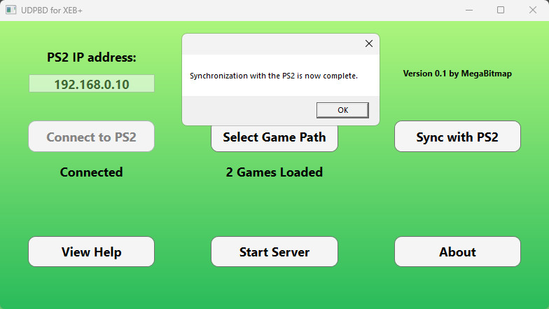
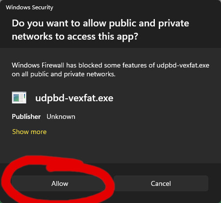
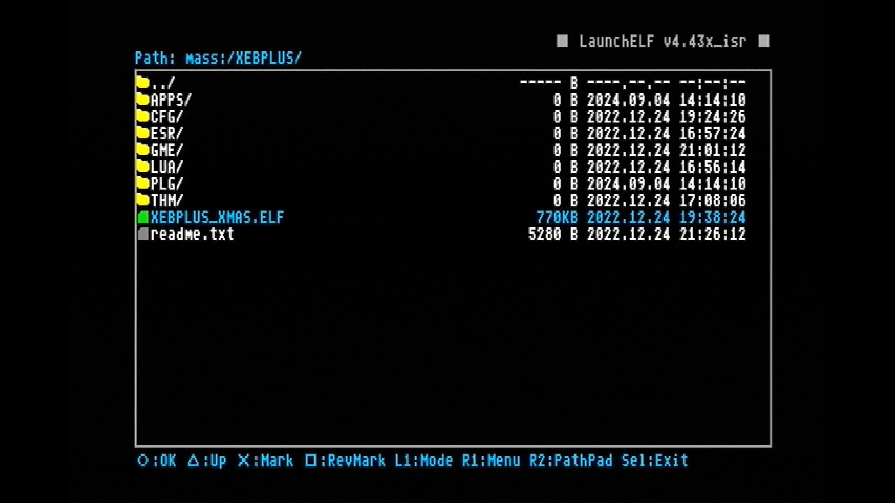
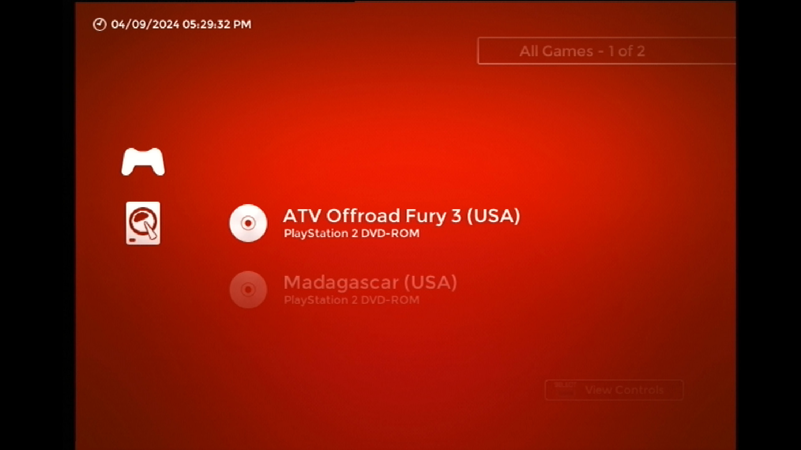

# THIS REPO IS UNDER CONSTRUCTION. WORK IN PROGRESS. DO NOT USE.

# UDPBD plugin for XtremeEliteBoot+

This is a plugin for the Xtreme Elite Boot Plus dashboard for the PlayStation 2.  
It allows XEB+ to load PlayStation 2 games from a PC via [neutrino](https://github.com/rickgaiser/neutrino).  
It is bundled with a windows app `UDPBD-for-XEB+.exe` to automate the setup process.

## Features

- Load PlayStation 2 game backups straight from the Xtreme Elite Boot Plus dashboard.
- Uses the vexfat (virtual exFAT) variant of the UDPBD server which includes support for NTFS and exFAT.
- Quick navigation functions for browsing large game lists.
- Remember last played game.
- Display game-specific artwork on the menu.
- Set neutrino compatibility flags and other options on a global or per-game basis.
- Favorites list.

## Requirements

- A PlayStation 2 console configured to run unsigned code via an exploit such as FreeMCBoot or PS2BBL.
- A PlayStation 2 slim with built in Ethernet or a fat model with an OEM network adapter.
- A MBR FAT32 formatted USB drive that is ready to be erased. This is used for XEB+ and assorted files. Game ISOs are stored on the PC.
- A Windows PC with enough free space to store ISOs.
- A Ethernet cable to connect the PS2 to the PC.

## Setup

1. Use [rufus](https://rufus.ie/en/) to format the USB flash drive with settings as shown:  

2. Download the Xtreme Eliete Boot Plus Xmas 2021 showcase [here](https://web.archive.org/web/20240729132341/http://www.hwc.nat.cu/ps2-vault/hwc-projects/xebplus/).  
3. Use [7-zip](https://7-zip.org/) to extract the `XEBPLUS` folder to the root of your USB drive. (Windows does not natively support `.rar` with passwords.)
The password is at the bottom of `xebplus_xmas_showcase.rar\Distibution License.txt`.
4. Download the [latest release on this page](https://github.com/MegaBitmap/UDPBD-for-XEBP/releases).
This will include the UDPBD plugin bundled with neutrino.
5. Extract the `XEBPLUS` folder and merge into the root of the USB drive.
6. Somewhere on your PC, example `Documents`, create a new folder `PS2`.
7. Inside the `PS2` folder, create `CD` and `DVD` folders.
8. Rip/copy any PlayStation 2 ISOs you wish to load into the folder that corresponds with their original source media.
9. All `.bin` + `.cue` games must be converted to `.iso` format.
[OPL manager](https://www.psx-place.com/resources/opl-manager-tool-to-manage-your-games.663/) will do this conversion.
10. Plug in the ethernet cable as shown:  

11. On the PC -> Settings -> Network -> Ethernet -> Use the following settings:  

12. Plug the USB flash drive from step 5 into the PS2.
13. Power on the PS2 while holding `R1` on the controller. In both freeMCboot and PS2BBL this opens launchELF.
14. In launchELF go to MISC:  

15. Run PS2Net.  

16. Once you reach this screen, you are ready for the next steps on the PC.  

17. From the [latest release on this page](https://github.com/MegaBitmap/UDPBD-for-XEBP/releases), extract the `UDPBD-for-XEB+` folder.
18. Run `UDPBD-for-XEB+.exe` and click connect.  

19. Click `Select Game Path` then choose an ISO from the `DVD` folder from step 8.
20. Click `Sync with PS2`, upon success this message will be displayed:  

21. Click `Start Server` and make sure to allow.  
  
If you miss clicked, either move the `UDPBD-for-XEB+` folder inside a new folder or manually delete the inbound rules for `udpbd-vexfat` in `Windows Defender Firewall with Advanced Security`.  
udpbd-vexfat will open minimized.
The server needs to be open and running for the entire play session. (Disable sleep on the PC.)
22. The PC setup is now complete, back on the PS2 run XEB+.  

It's recommended to set freeMCboot or PS2BBL to autorun the `.ELF` file.
23. Play!  

## Add/Remove Games
Repeat steps 13-23 of the setup process each time you add or remove games.

## Adding Artwork
The Neutrino UDPBD Loader plugin can display game-specific artwork in the selection menu.  
This feature uses the same file type and naming conventions as Open PS2 Loader,  
which allows the plugin to take advantage of existing PS2 artwork libraries designed for OPL.  

To make use of this feature, the following additional steps are required:

1. Ensure that the games you wish to display artwork for have their PlayStation 2 title ID somewhere in the filename.  
Most title ID formats will work, such as `SLUS_123.45`, `SLUS-12345`, `SLUS.12345`, `SLUS12345`, ect.  
2. Prepare or acquire artwork files with the same file format and naming conventions as those used by OPL.  
Note that only background (*_BG*) and disc art (*_ICO*) files are used by this plugin.  
3. Copy the artwork files you wish to use to `/XEBPLUS/GME/ART` on your USB drive.  
It is recommended that you copy as few files as possible to this directory.  
4. Launch XEB+ and select the Neutrino Loader (UDPBD) plugin.  
If the plugin detects files at `/XEBPLUS/GME/ART`, it will automatically create an artwork cache in the plugin folder.  
This is necessary to maintain a usable level of performance while displaying artwork in the menu.  
The caching process can take a long time to complete the first time it runs,  
potentially up to several hours if you have a very large game library.  
Reducing the number for files in the `ART` folder can speed up this process somewhat.  

Changing the contents of the `CD` or `DVD` folders on the USB drive,  
or modifying the cache folder, will trigger a refresh of the artwork cache the next time the plugin is launched.  
A refresh can also be triggered manually from the plugin settings.  
Cache refreshes take much less time than initial creation, so long as the cache folder has not been moved or deleted.

<h2>Usage</h2>
<h3>Controls</h3>
CROSS -         <b>confirm / launch game</b> 
CIRCLE / LEFT - <b>cancel / close plugin</b> 
SQUARE -        <b>open context menu</b> 
TRIANGLE -      <b>show favorites / show all</b> 
DOWN -          <b>scroll down</b> 
UP -            <b>scroll up</b> 
R1 -            <b>scroll down 10 items</b> 
L1 -            <b>scroll up 10 items</b> 
R2 -            <b>jump to next letter</b> 
L2 -            <b>jump to previous letter</b> 
R3 -            <b>jump to bottom of list</b> 
L3 -            <b>jump to top of list</b> 
SELECT -        <b>view control map</b>
<h3>Basic Usage</h3>

Launch the XEB+ dashboard on your PlayStation 2 console, and select *Neutrino Launcher (UDPBD)* from the menu.  
Wait a moment for the plugin to load.  
If there are artwork files present, you may need to wait for the artwork cache to build or refresh.  
Select a game from the list to launch it with Neutrino, or press back to close the plugin.    

## Game Options
Press SQUARE while in the game selection menu, and the context menu will open.  
Context menu options apply to the currently highlighted game by default, and are as follows:

* **Add To Favorites** - Adds the current game to the favorites list.
If the current game is already in the favorites list, this option will remove it.  

* **Global / Per-Game Settings** - This option toggles between Global and Per-Game settings modes.
When set to Global Settings, options shown below this one will apply to all games.
When set to Per-Game Settings, options shown below this one will apply only to the current game.

* **Enable Boot Logo** - When enabled, the PlayStation 2 logo will be shown on screen when starting a game.
This slightly increases the start time.

* **Enable Debug Colors** - When enabled, a series of colors will flash on screen when starting a game.
This can be used to help diagnose games that will not start.

* **Accurate Reads** - When enabled, the data transfer rate for games will be limited to that of the PlayStation 2 DVD drive.
This will increase load times, but can fix compatibility issues with some titles.

* **Synchronous Reads** - When enabled, asynchronous (background) loading will not be used.
This can affect load times, and fixes compatibility issues with some titles.

* **Unhook Syscalls** - When enabled, neutrino Syscalls will be removed from memory after starting a game.
This fixes compatibility issues with some titles.

* **Emulate DVD-DL**- When enabled, neutrino will emulate the data structure of a dual-layer DVD.
This option is required for DVD9 images that have been modified to fit a DVD5.

* **Refresh Artwork** - Immediately delete and re-copy cached artwork for the current game.
This option is only available for games with a valid title ID in their filename, and is not affected by the current settings mode.

Closing the context menu will automatically save the currently selected options. 

## Favorites
Games can be added to a favorites list for easy organization and quicker access.  
To add a game to the favorites list, open the context menu and select "Add To Favorites", as described in the previous section.  
Repeat this process to remove a game from the favorites list.  
When a game is in he favorites list, the word "Favorite" will be show below it's file name on the game selection menu.  
To access the favorites list, press TRIANGLE while on the game selection menu.  
Press TRIANGLE again to show all games.  
The plugin will always start up to the all games list, even if it was previously closed while viewing the favorites list.

## Neutrino UDPBD Loader Settings
This package includes a secondary plugin called <i>neutrino Launcher (UDPBD) Settings</i>,
which is accessible from the far right column of the XEB+ dashboard.  
This contains a settings menu whose options apply to the main neutrino Loader plugin.  
The available options are as follows:

  * **Disable Artwork** - When enabled, game specific artwork will not be shown on the menu. This can prevent the cache from auto-refreshing in some cases.
  * **Disable Status Messages** - When enabled, the text that appears at the bottom of the screen to indicate loading and other behavior will not be shown.
  * **Disable Icon Animation** - When enabled, the disc icon for the current game will not spin
  * **Refresh Artwork Cache** - Sets artwork cache to refresh next time the main plugin is loaded

## Known Issues and Limitations

  * Artwork cannot be refreshed from the context menu while in the favorites list.
  * If an artwork cache build / refresh is interrupted, the system may crash the next time the plugin is loaded.  
If this happens, the behavior will persist until the cache is refreshed manually.
  * The neutrino Loader plugin can take up to 30 seconds to load, and may appear to hang if there are a large number of games present.
  * If enabled, the PlayStation 2 boot logo will display incorrectly for games that do not match the console's region.
  * Repeatedly closing and re-opening the Neutrino Loader plugin can cause the system to crash.
  * Scrolling through the list quickly may cause corrupted graphics to be displayed briefly.
  * This plugin does not currently support virtual memory cards. Further development / testing is required to implement this feature.

## Credits

Big thanks to these developers:  

awaken1ng - udpbd-vexfat - v0.2.0  
https://github.com/awaken1ng/udpbd-vexfat

Howling Wolf & Chelsea - XtremeEliteBoot+  
https://www.psx-place.com/threads/xtremeeliteboot-s-dashboard-special-xmas-showcase.38959/

Rick Gaiser - neutrino - v1.3.1  
https://github.com/rickgaiser/neutrino

sync-on-luma - neutrinoHDD plugin for XEB+ - forked from v1.0.1  
https://github.com/sync-on-luma/xebplus-neutrino-loader-plugin
